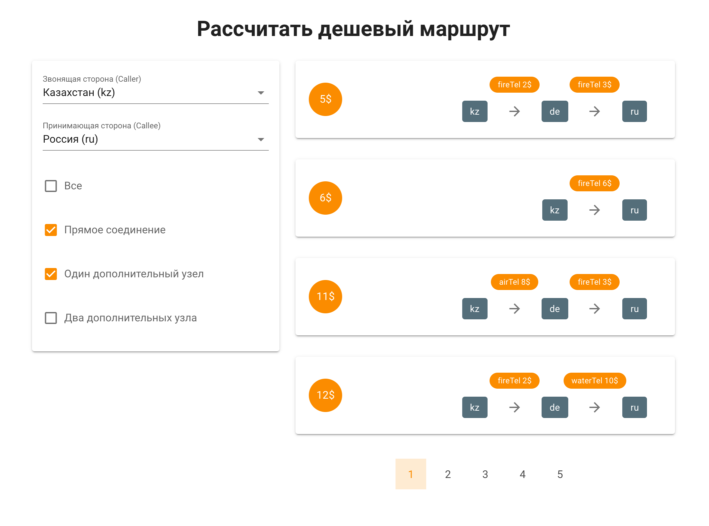

### Задача 3

Перед вами макет фильтрации маршрутов звонков (логика маршрутизации выдумана и имеет малое сходство с реальностью).
Необходимо реализовать клиент по фильтрации и сортировки этих маршрутов.

*Макет служит для визуализации необходимого функционала, повторять дизайн необязательно. В своем решении допускается использование любого ui фреймворка.*

В решении должны быть:
- Форма с двумя выпадающими списками стран и чекбоксами для фильтрации
- Отсортированные маршруты по цене от меньшей к большей
- Пагинация списка

В [файле](call-paths.json) представлены mock данные с сервера.
```js script
  const requst = {
    'data': {
      company: {
        'waterTel': [ // Название телеком компании
          {
            'src': 'kz', // Звонящая сторона (Caller)
            'des': 'usa', // Принимающая сторона (Callee)
            'price': 9 // Цена
          },
        ],
      },
      country: { // Расшифровка стран
        'ru': 'Россия',
        'kz': 'Казахстан',
        'de': 'Германия',
        'us': 'США'
      }
    }
  }
```

#### Принцип работы

Предоставлять пользователю все возможные маршруты 
(в маршруте указываются страны, через которые проходит звонок, и операторы, обслуживающие соединение) 
от "Звонящий стороны" до "Принимающей стороны",
отсортированные по цене (в одном маршруте страны не могут повторяться). Фильтры маршрутов в виде чекбоксов
"Прямое соединение" - без промежуточных стран, "Один дополнительный узел" - с одной промежуточной страной и т.д.

#### Условия

- Используйте Vue
- Работоспособность в актуальной версии Google Chrome
